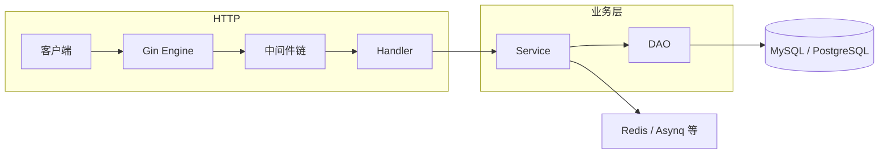

# 新人入门：架构一页纸与常见问题

面向：**第一次接手本仓库、希望少问人、能按文档自举开发**的后端同学。细节仍以各专题文档与代码为准。

## 架构总览（请求怎么走）

典型顺序（简化）：

1. **Gin** 匹配路由，进入全局中间件（恢复、日志、限流、租户解析等，以 `routes` 与 `middleware` 为准）。
2. **鉴权**：客户端 JWT、管理端权限（如 `RequirePermission`）在路由或中间件中校验。
3. **Handler**（`api/handler`）：解析请求、调用 **Service**。
4. **Service**（`internal/service`）：业务规则、事务、调用 **DAO** 或外部组件（Redis、队列、通知等）。
5. **DAO**（`internal/dao`）：GORM 访问数据库；复杂 SQL 可集中在 DAO。

**和文档的关系**：环境与本机运行见 [快速开始](/guide/quick-start)；租户、审计、幂等、事件、通知等横切能力见 [平台能力](/guide/platform)；错误响应规范见 [错误处理](/guide/error-handling)。

## 目录职责（背这张表就够日常用）

| 路径 | 职责 |
|------|------|
| `cmd/server` | HTTP / Worker 进程入口 |
| `cmd/migrate` | 数据库迁移（schema 与 seed 分开执行） |
| `cmd/gen` | 后台 CRUD 代码与 **MySQL** 迁移/权限 seed 生成 |
| `cmd/artisan` | 控制台命令（可挂定时/运维任务） |
| `config` + `configs/` | 配置加载、校验、多环境模板 |
| `routes/`、`routes/adminroutes/` | 路由注册（新模块常要在这接线） |
| `api/handler`、`api/request`、`api/response` | HTTP 层 |
| `internal/service`、`internal/dao`、`internal/model` | 业务与持久化 |
| `migrations/mysql`、`migrations/postgres` | 按库的 schema / seed SQL |
| `docs/` | 文档站（VitePress） |

## 推荐阅读顺序（新人）

1. [项目简介](/guide/introduction)（本页可与其一起看）  
2. [快速开始](/guide/quick-start)  
3. [配置说明](/guide/configuration)  
4. [命令系统](/guide/commands)  
5. [开发同学路径](/paths/developer) 中的 Day 1 及之后  

加业务模块时配合：[代码生成](/guide/codegen) 与 [Codegen 实战](/guide/codegen-walkthrough)。

---

## 常见问题（FAQ）

### 1. 迁移报错「表已存在」或 SQL 执行失败

先确认：是否已对目标库执行过旧版迁移。`migrate up` 只跑 **schema**，`migrate seed up` 只跑 **seed**；版本记录在表 `migrations`（gormigrate 默认）。开发库可重建后重跑；生产需按运维流程处理，勿随意删表。详见仓库内 `migrations/mysql/README.md`。

### 2. `empty dsn` 或连不上数据库

`go run ./cmd/migrate ...` 与运行服务都需要有效 DSN：通过环境变量 **`DB_DSN`** 或命令行 **`--dsn`**。`--env dev` 时会尝试加载 `.env` 系列文件，路径与优先级见 [配置说明](/guide/configuration)。

### 3. 时间与日志里的时间对不上

应用与迁移支持 **`TIME_ZONE`** / `db.time_zone` 等与 MySQL 会话时区对齐。容器内 MySQL 建议 `default_time_zone` 与之一致。见 [生产运行手册](/ops/production-runbook) 中与时间相关的说明。

### 4. Redis 或 Asynq 相关报错

确认配置里 Redis 地址、密码与本地/容器是否一致；未启用相关能力时可在配置中关闭对应开关，避免启动强依赖（以当前 `configs` 与校验逻辑为准）。

### 5. 管理接口返回 403 / 无权限

检查：该路由是否挂了 **`RequirePermission("xxx:yyy")`**；种子是否已为当前角色写入 **`role_permissions`**；请求是否带 **`Authorization: Bearer <token>`** 且用户角色与租户正确。

### 6. 多租户：数据串租户或登录失败

管理端请求需带 **`X-Tenant-ID`**（或与项目约定一致的租户头），且用户、角色数据需属于该租户。详见 [平台能力](/guide/platform) 中与租户相关的章节。

### 7. Swagger 在哪里、如何更新

本地启动服务后访问项目配置的 Swagger 路径（常见为 `/swagger/index.html`，以路由注册为准）。注释变更后执行文档站或 README 中给出的 **`swag init`** 命令重新生成文档包。

### 8. `cmd/gen` 只生成了 MySQL 迁移，项目是 PostgreSQL

生成器默认写 **`migrations/mysql/`**。PostgreSQL 需在 **`migrations/postgres/schema` 与 `seed`** 下维护等价脚本（时间戳建议与 MySQL 对齐）。见 [代码生成](/guide/codegen) 中 PostgreSQL 小节。

### 9. 集成测试一直 Skip

集成测试使用 build tag **`integration`**，且需设置环境变量（如 **`INTEGRATION_BASE_URL`**、管理员账号密码等）。见 `tests/integration/README.md`。

### 10. 只执行了 `migrate up`，没有菜单 / 权限数据

结构迁移与种子是分开的：执行完 **`migrate up`** 后还需 **`migrate seed up`**（MySQL / PostgreSQL 各自对应用 `--driver` 与 `--dsn`）。详见 [命令系统](/guide/commands)。

---

仍无法解决时：在 issue 或团队频道带上 **命令、环境（driver、是否 dev）、脱敏后的报错栈**，便于快速定位。
